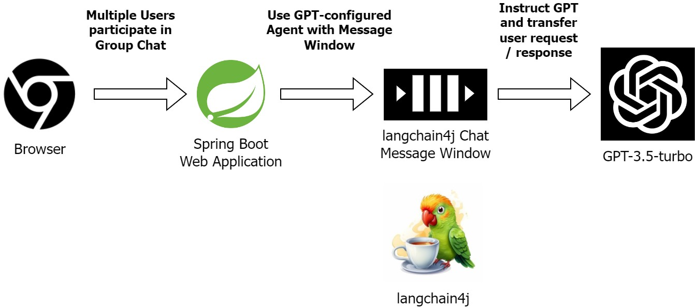

# Devs & Architects Assembly with Polymindra

## Setup

* Install Java 21 (use https://sdkman.io/ for non-win & wsl2)
* Change OpenAI API key in `src/main/resources/application.properties`
* Run `mvnw spring-boot:run`

## Use

* Open http://localhost:8080
* Enter chat username
* Invite others to join the chat
* Start discussing with your colleagues, supported by Polymindra